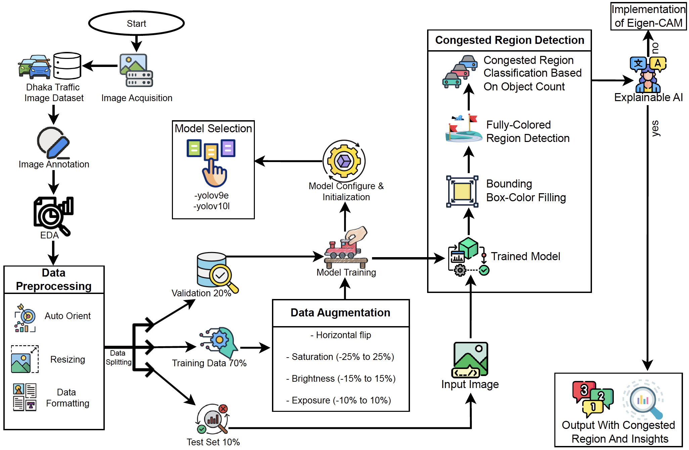
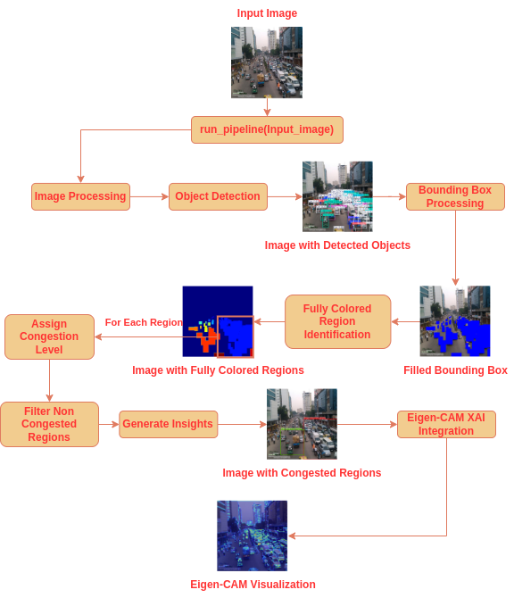
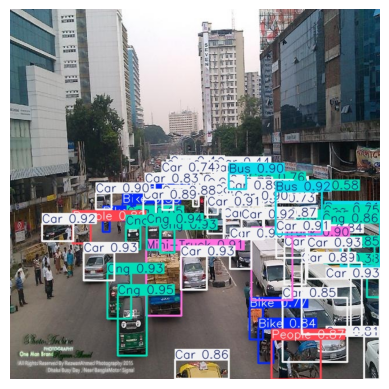
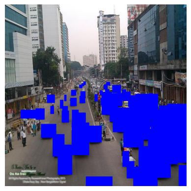
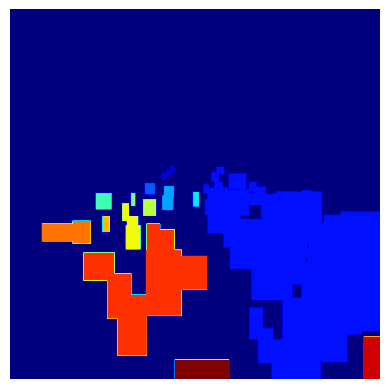
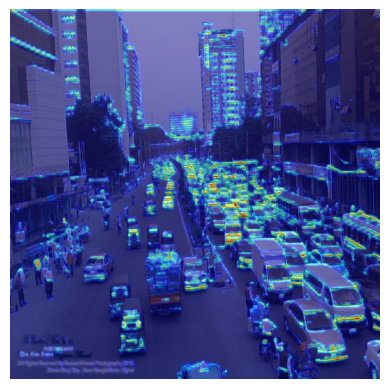

# Traffic Congestion Region Detection (TCRD) Framework

## Overview
The **Traffic Congestion Region Detection (TCRD) Framework** is a comprehensive tool developed for identifying and analyzing traffic congestion in urban areas like Dhaka. Leveraging state-of-the-art (SOTA) YOLO models and explainable AI, this framework provides detailed insights into traffic anomalies, enhancing urban traffic management and planning.

---

## Project Workflow
The project workflow is outlined in the following diagram:

## Models and Datasets
### Trained Models
1. **YOLOv9e**:
   - Original Dataset: Bangladesh Traffic Flow Dataset ([DOI: 10.17632/h8bfgtdp2r.2](https://doi.org/10.17632/h8bfgtdp2r.2))
   - [Yolov9 Formatted Dataset](https://universe.roboflow.com/tishas-workspace/traffic-congestion-detection-16ol4)
   - Implementation: [`yolov9e/tcd_v9_version2_e50.ipynb`](yolov9e/tcd_v9_version2_e50.ipynb)
   - Results stored in: [`yolov9e/detect/yolov9e_ppe_css_50_epochs`](yolov9e/detect/yolov9e_ppe_css_50_epochs)
   - Weights: Download from [Google Drive](https://drive.google.com/drive/folders/1kFKvWHMlVikhZLVioI_HUifzeo9QwGAk?usp=drive_link) and place it to [`yolov9e/detect/yolov9e_ppe_css_50_epochs/weights`](yolov9e/detect/yolov9e_ppe_css_50_epochs/weights)
   - Metrics (50 epochs):
     - Precision: 0.667
     - Recall: 0.764
     - mAP50: 0.764
     - mAP50-95: 0.508

2. **YOLOv10l**:
   - Original Dataset: Dhaka AI Traffic Dataset ([DOI: 10.7910/DVN/POREXF](https://doi.org/10.7910/DVN/POREXF))
   - [Yolov9 Formatted Dataset](https://universe.roboflow.com/tishas-workplace/traffic-congestion-detection-vbbnb)
   - Implementation: [`yolov10l/YOLOv10_120E.ipynb`](yolov10l/YOLOv10_120E.ipynb)
   - Results stored in: [`yolov10l/detect`](yolov10l/detect)
   - Weights: Download from [Google Drive](https://drive.google.com/drive/folders/1pz7fTob5Og9fvO0wDZZKb-zWogfy_7ML?usp=drive_link) and place it to [`yolov10l/detect/weights`](yolov10l/detect/weights)
   - Metrics (120 epochs):
     - Precision: 0.794
     - Recall: 0.675
     - mAP50: 0.752
     - mAP50-95: 0.523

### Object Classes
The datasets focus on a congested urban environment with the following object classes:
- Bike
- Bus
- Car
- CNG
- Cycle
- Mini-Truck
- People
- Rickshaw
- Truck

### Implementation Environment
Kaggle is recommended for its GPU support and storage capabilities. The training and detection notebooks are designed for seamless execution in Kaggle.

---

## Framework Implementation
### Main File
The core implementation of the TCRD framework is in the file: [`final-tcrd-framework.ipynb`](final-tcrd-framework.ipynb). This file integrates trained YOLOv10l model for:
1. Object detection.
2. Region congestion analysis.
3. Visualization of results.

### TCRD Framework Workflow Diagram

  

### Sample Results
1. **Object Detection**:

   
   
   - Detected: 5 Bikes, 4 Buses, 42 Cars, 14 CNGs, 2 Mini-Trucks
   - Processing Time: 2750.6ms

3. **Blue Bounding Boxes**:

   

5. **Masked Local Regions**:

   
   
   - Total Regions: 15
   - Congestion Levels:
     - Region 2: **Heavy Congestion** with 43 boxes
     - Region 12: **Light Congestion** with 7 boxes

7. **Explainability with Eigen-CAM**:

   
   
   - Detected: 6 Bikes, 4 Buses, 46 Cars, 14 CNGs, 5 Mini-Trucks, 2 People
   - Processing Time: 2450.0ms

---

## How to Use
1. **Set up YOLOv10 Weights**:
   - Download `best.pt` from [Google Drive](https://drive.google.com/drive/folders/1pz7fTob5Og9fvO0wDZZKb-zWogfy_7ML?usp=drive_link).
   - Place the file locally by creating a new directory `yolov10-models/weights/`.
   - Zip the folder and upload it to Kaggle as `tcd-yolov10-models` dataset.

2. **Run the Framework**:
   - Upload `final-tcrd-framework.ipynb` to your Kaggle workspace.
   - Execute the notebook to process test images and analyze results.

---

## Contribution
Contributions to this repository are welcome! Potential improvements include:
- Training new models with updated datasets.
- Optimizing the TCRD framework for faster processing.
- Enhancing explainability methods.

---

## Future Impact
The TCRD framework aims to:
- Support government sectors in traffic management.
- Provide actionable insights for urban planning.
- Minimize congestion and improve urban quality of life through advanced AI techniques.
